# 🚀 Atliq Hardwares Ad-Hoc Insights for Management Using SQL 

📌 Project Overview  
This project focuses on solving **10 ad-hoc business requests** using SQL to generate actionable insights for *AtliQ Hardwares*, a computer hardware company leveraging data-driven strategies for growth.  

---

🎯 Problem Statement  
The management team lacked quick and actionable insights for decision-making.  
To solve this, I analyzed business data and answered **10 real-world business questions using SQL**.  

---

🛠️ Tools & Skills Used  
- SQL, Power Point  
- Joins (INNER, LEFT, RIGHT)  
- CTEs (Common Table Expressions)  
- Window Functions  
- Subqueries  
- UNION  
- CASE Statements  

---

📊 Key Insights  
- 📈 Achieved **36% product growth**  
- 💻 Notebooks (129) & Accessories (116) lead in product count  
- 🧩 Accessories added highest unique products (34)  
- 💰 Manufacturing cost ranged from **$0.91 to $241**  
- 🚀 Retailer channel generated highest revenue (**$121,908 Million**)  

---

💡 Learnings  
- Translated business problems into SQL queries  
- Extracted meaningful insights from raw data  
- Improved analytical thinking and problem-solving  
- Understood how data drives business decisions

---

🔗 Portfolio  
👉 https://codebasics.io/portfolio/Chirag-Pacheria

---

📸 Project Screenshots (PPT)

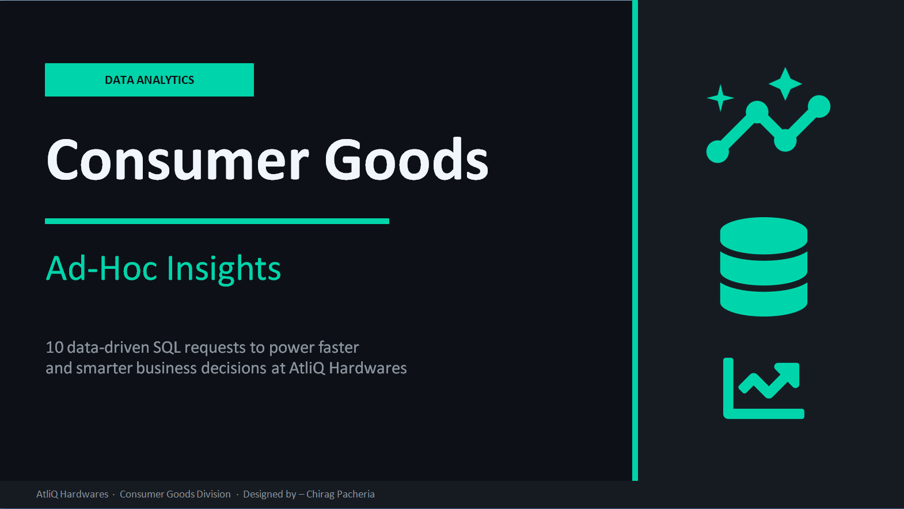
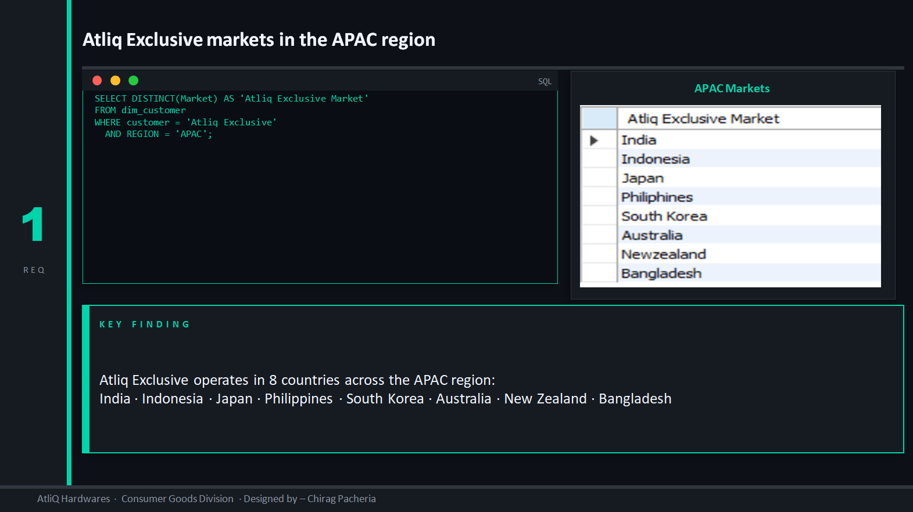  
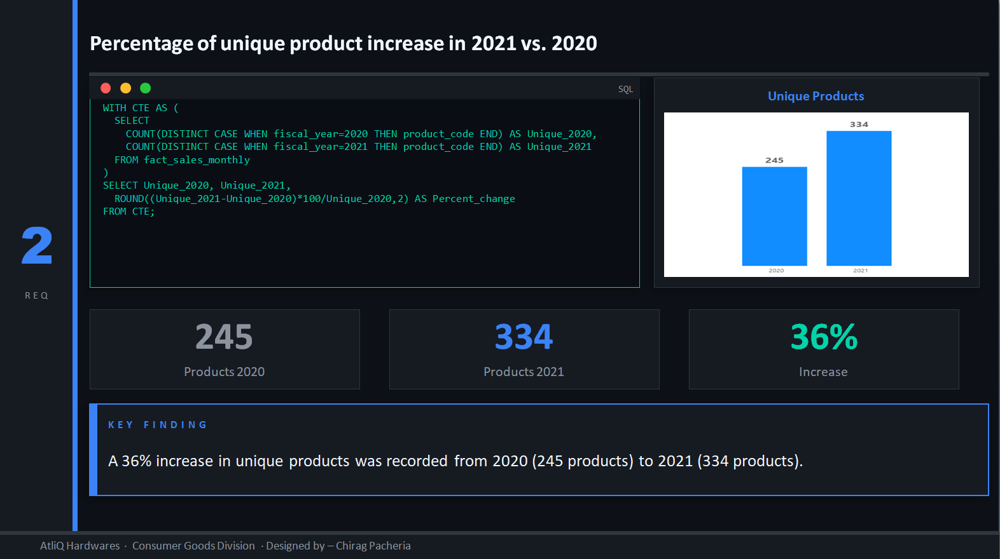
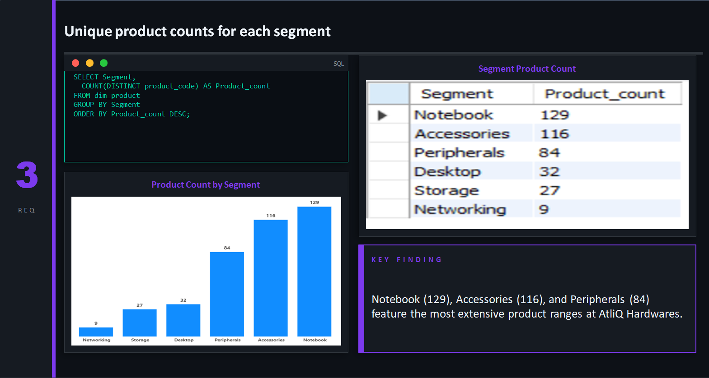
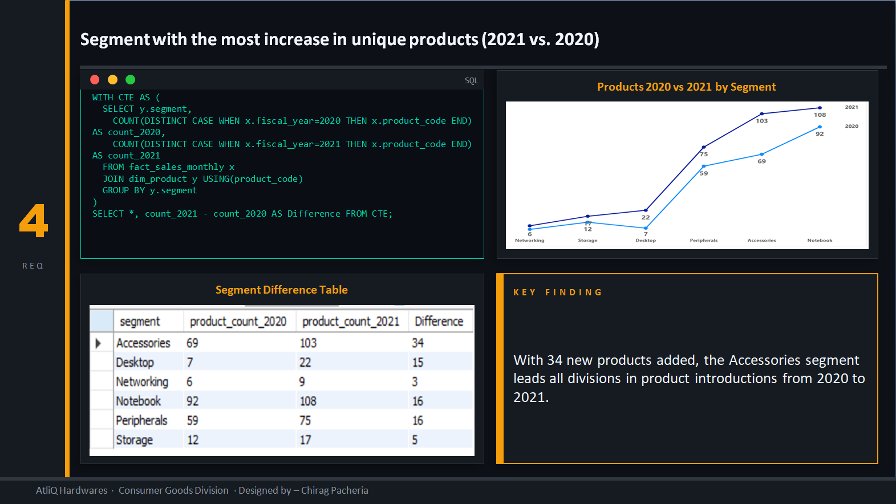  
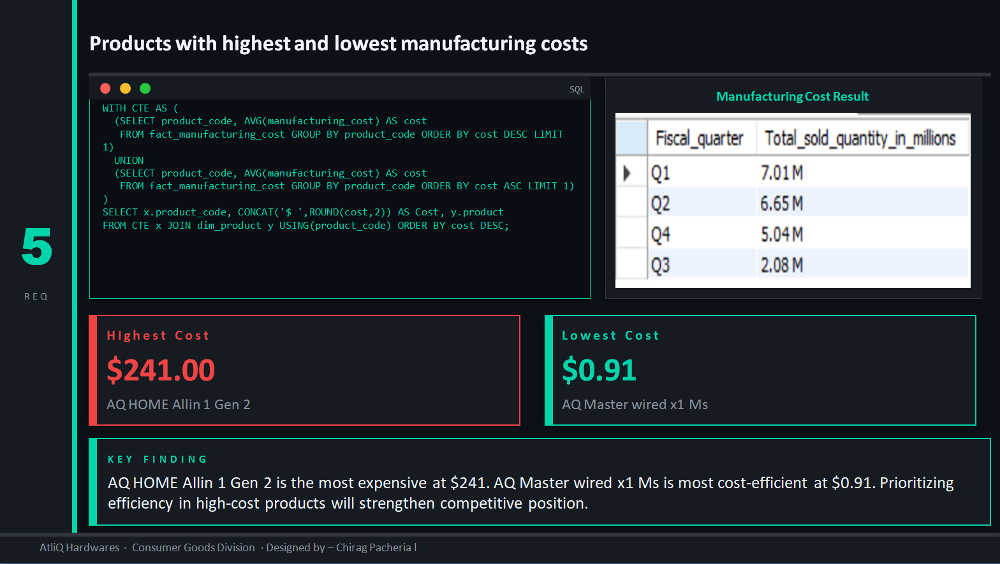
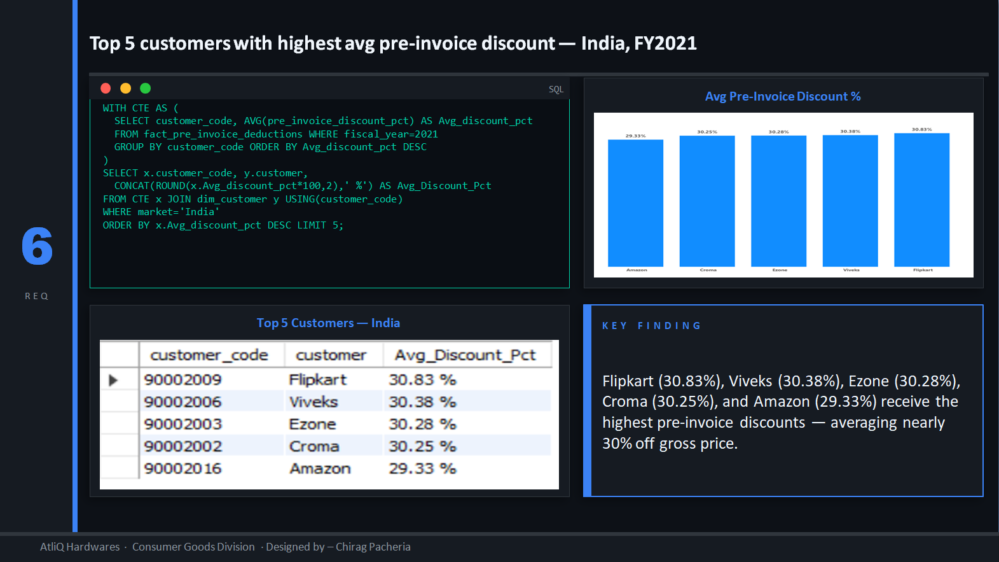
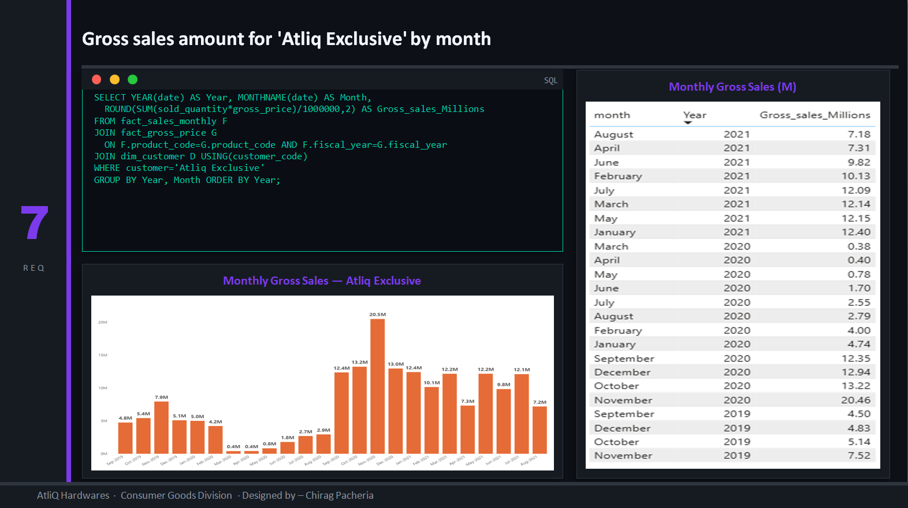  
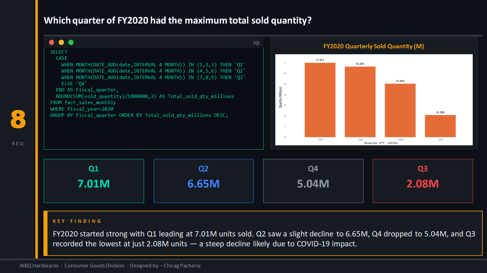
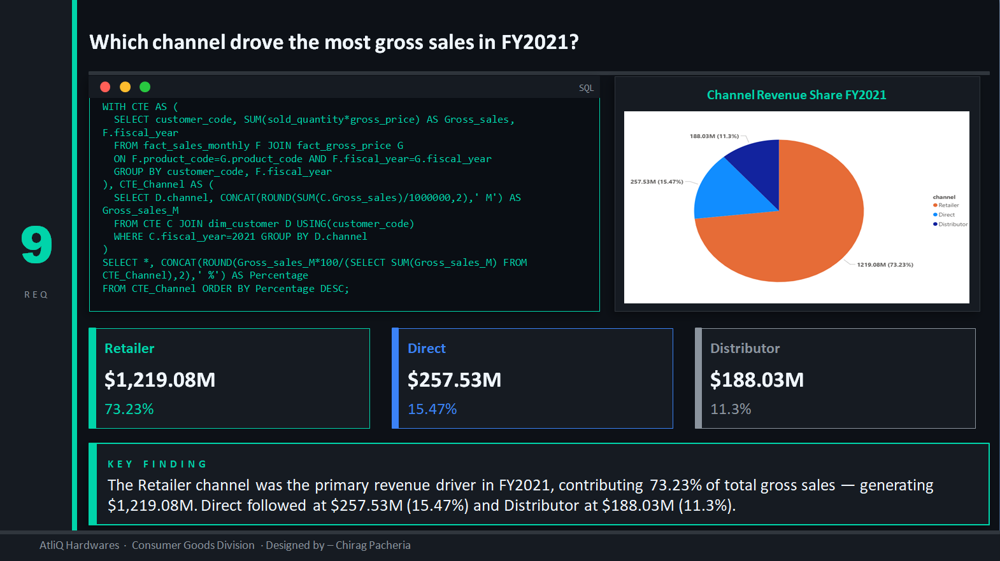
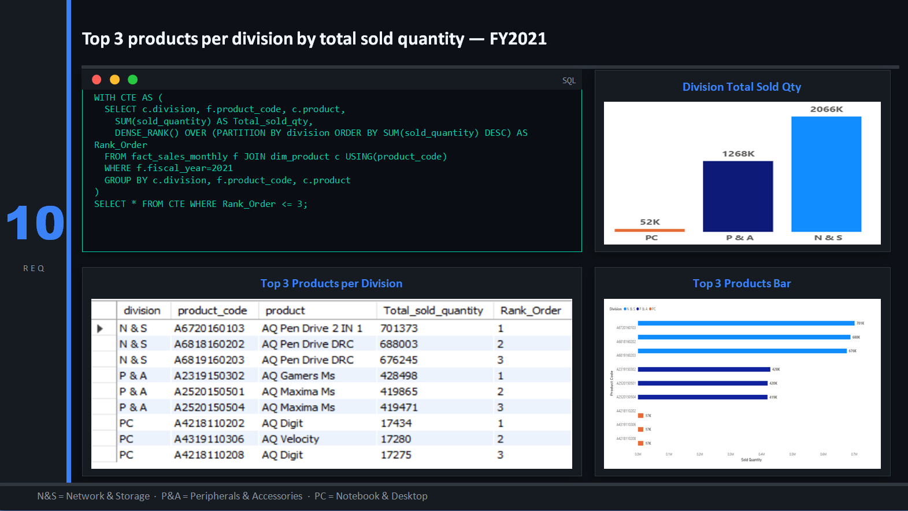
